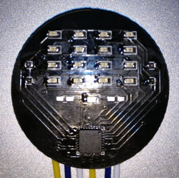

# BCDWristWatch
## First PCB Version
The First PCB Version was a desaster. The PCBs arrived very fast, but the QFN Package had the wrong size. 
ATMEL only produces QFN32 in 7x7mm. Therefore the design of the PCB hat to be changed to the smaller package,  
but that gave me the Chance to shrink the Design to a smaller form factor. 
The part which keeps the PCB from getting smaller is the Coin Cell Battery (CR2032). 
On the PCBs there was the order number printed on the Front side, which would be visble in the final assembly. 
## Second PCB Version
The second PCB Version was designed from scratch. But the Front was the side with the Battery, so hopefully the Order Number would not be printed on the visible side of the PCB. This worked out very well for the second Version of the PCBs.
### PCB1
since the PCBs finally arrived. it was possible to assemble all the parts. 
The first PCB was assembled with some Cables soldered to the Testpins on the Backside of the Board. 
And the Battery case was also not assembled. 
Here is a Picture of the uncleaned but already soldered PCB 

### PCB2
The PCB2 was assembled and cleaned as a First Prototype with the Housing.  
Here aretwo Pictures of the PCB one without the LEDs turned on and one with the LEDs turned on.  
Brightness was set in the Program to 100/255 (see software void showLEDs, constant perc=100) 

### PCB3
The third PCB was ordered at aisler.net. It only took around one and a half week to arive(to Germany). 
The PCB was not completely milled out. It was in a carrier PCB with rectangular shape, but it was easy to remove. 
I had to sand the edges a bit, since it was a bit rough on the parts where i removed the connections to the carrier, since i had to sand the PCB anyway to fit in the Housing that was no big problem. 
The overall Quality of the PCBs is very good, but you can not choose the thicknes or color of the PCB. 
<b>TODO add Photos</b>

## Housing
The Housing was designed in OpenSCAD.  
a very helpfull reference for the OpenSCAD syntax was 
https://en.wikibooks.org/wiki/OpenSCAD_User_Manual/Transformations

### Housing 1
The Housing was printed by the TOOM Printing Service as SLS in PLA.  
Sadly all the surfaces are not really smooth, therefore the Buttons are working very bad. 
I tried to glue in the glass with superglue, but the glue dried out white, this looks really bad :-( 

### Plans for Housing 2
The next housing should be produced via SLA with transparent Resin, so no glass for Protection is needed, 
since the resin could be used.

### Housing 2
A friend told me that most of the time the resin will not reflect light equally in every spot, therefore i decided to order a PCB without glass and do the mounting of the glass with very tight tolerances and a rim on the top edge. 
this worked out extremely well. 
Another goal was to make the second Housing slim, because the first one was very bulky. With a bit of optimization is was possible to integrate the bottom plate completely in the housing. The overall thicknes was reduced from about 15mm to 9.4mm with the 1mm PCB or 10mm with the new 1.6mm PCB. 
<b>TODO add Photos</b>
